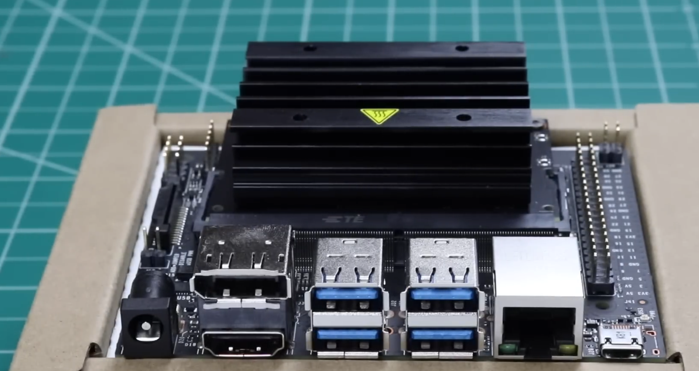
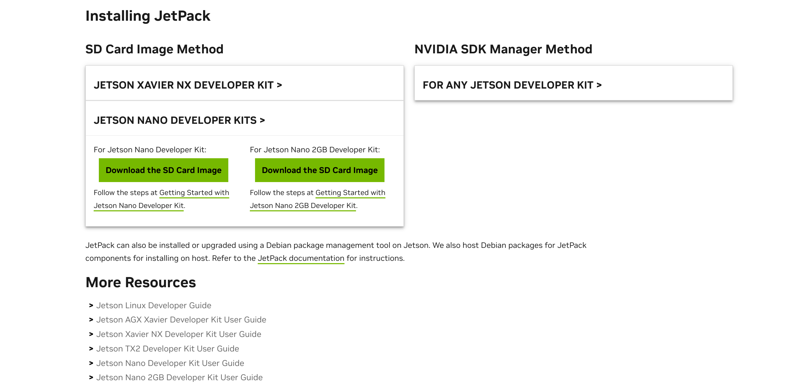
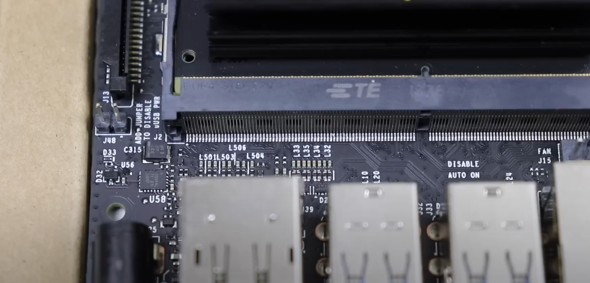
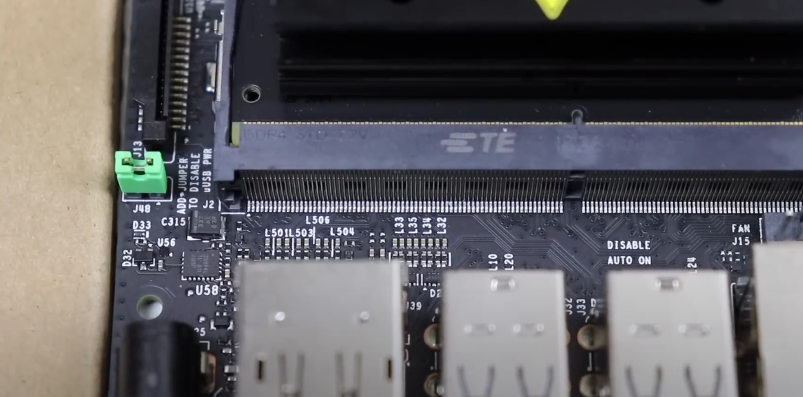
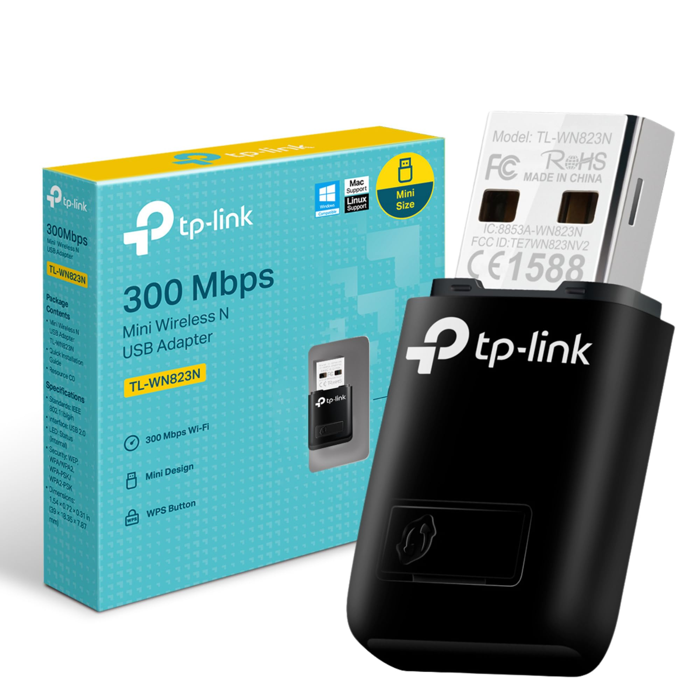

# Jetson Nano setup

To prepare a Jetson Nano for using ROS with the `JetPack SDK 4.6`, follow these steps:

### 1. Flash the Jetson Nano with the Image

1. **Download the Image**:
   - Download the `JetPack SDK 4.6` from the NVIDIA website or other trusted sources.
 #  - [JetPack SDK 4.6 Releases](https://developer.nvidia.com/embedded/jetpack-archive)

2. **Prepare the SD Card**:
   - Use tools like [Etcher link](https://etcher.balena.io/#download-etcher) to flash the image onto a microSD card.
   - Insert the microSD card into your Jetson Nano.

3. **Initial Setup**:
   - Power on the Jetson Nano and follow the on-screen instructions to complete the initial setup.



The NVIDIA Jetson Nano offers several power options to cater to different use cases and power requirements. Here are the primary power options:

### Power Modes
1. **5W Mode (Power Efficiency Mode):**
   - Limits the CPU to a single core at a lower clock speed.
   - Suitable for applications requiring lower power consumption.

2. **10W Mode (Max Performance Mode):**
   - Enables all CPU cores at higher clock speeds.
   - Suitable for applications requiring maximum performance.

### Power Sources
1. **Micro-USB Port:**
   - Provides a 5V, 2A power supply.
   - Suitable for light workloads or when using peripherals that don't draw significant power.
   - Limitation: If peripherals draw more power, it may lead to stability issues.


2. **DC Barrel Jack (5V-4A):**
   - Provides a more robust 5V, 4A power supply.
   - Recommended for heavier workloads and when using multiple peripherals.
   - Provides more stability and is better suited for the 10W performance mode.




### other resources [Get Started With Jetson Nano Developer Kit](https://developer.nvidia.com/embedded/learn/get-started-jetson-nano-devkit#intro)

### 2. Internet connection for jetson nano :

- **using Eathernet cable connected to router** 


- **Wifi module like TL-WN823N** 


```bash
#to get the ip adress of your pi in the network  nmap -sn <IP FORM.*> 

nmap -sn 192.168.1.*

```

### 3. install ROS on Jetson
open terminal inside the dir `setup_scripts` and run the following command
```sh
./installROS_jetson.sh -p ros-melodic-desktop
``` 